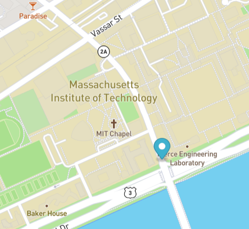

# Bus Tracker
Using Mapbox's open source data, this map shows a marker that moves along the bus route from MIT to Harvard University, pausing at each stop. This can be used to track a bus in real time, like the popular college app Doublemap does for campus buses.

